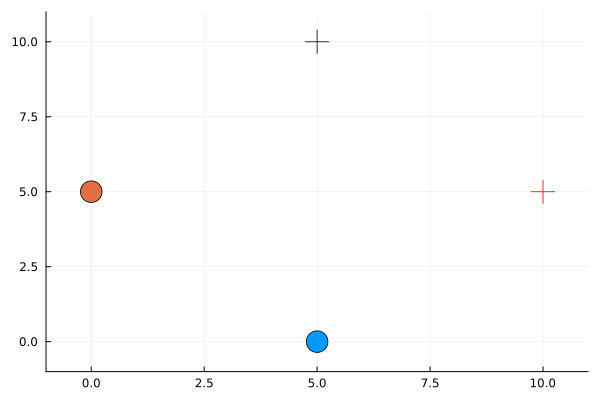

# iLQGame solver for multi-agent robotic interactions

This repo is inspired by [ilqgames](https://arxiv.org/abs/1909.04694), efficient iterative linear-quadratic approxmiations for nonlinear multi-player general-sum differential games. 

It is still a work in progress. An example of a two 2D point-mass agents navigating at an intersection can be shown in the following GIF. 

### Todo list:

- Add documentation, remove old code, and write report

- Receding horizon

- Put code in .jl file instead of .ipynb 

- Integrate the linear approximation of the nonlinear dynamics for multiple agents (linearize and discretize)
    - Check that the point mass works using both dynamics

- Add state constraints

- Use differential drive kinematics to use on TurtleBots
    - Add TurtleBot to MeshCat to visualize results

- Check augmented lagrangian dynamic programming for equality and inequality constraints

- Monte Carlo simulations to observe Nash Equilibria solutions
